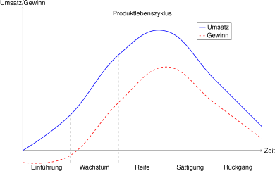

# Product

Das Produkt ist nach wie vor das zentrale Element eines jeden
Unternehmens. Nur wenn mit dem Produkt ein Kundenbedürfnis gedeckt
werden kann, kann es auch verkauft werden.

Das Produkt muss für den Kunden also einen Nutzen stiften. Dabei werden
verschiedene Nutzenarten unterschieden. Insbesondere wird zwischen
Grund- und Zusatznuten unterschieden. Der Grundnutzen ist der
*funktionale* Nutzen, den ein Produkt stiftet. Bei einem Auto ist das der
motorisierte Transport von A nach B. Zusatznutzen ist, was über den
Grundnutzen hinausgeht. Dies sind insbesondere auch emotionale,
psychologische und soziale Aspekte. Bei einem Auto ist das
beispielsweise der
Komfort oder der Status, den ein Auto vermittelt.

Unternehmen in Westeuropa sind vielfach mit Märkten konfrontiert, welche
in der Regel gesättigt sind. Produkte können entsprechend nicht mehr
ausschliesslich wegen ihres Grundnutzens verkauft werden. Das
eigentliche Verkaufsargument ist der Zusatznutzen.

